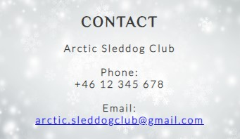
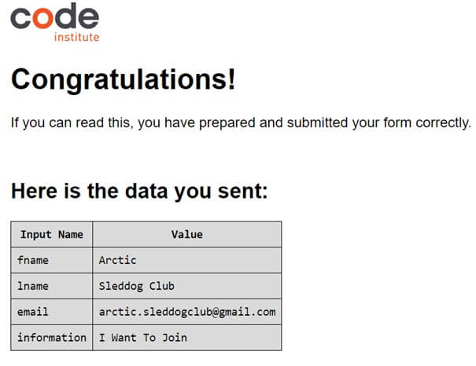
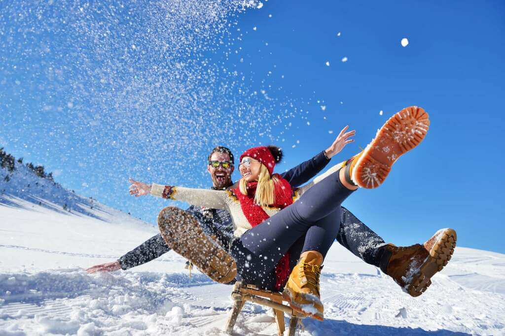

# ARCTIC SLEDDOG CLUB

# Introduction

## Welcome to the website of Arctic Sleddog Club

The Arctic Sleddog Club is a club located in the far north of Sweden in a town called Abisko.
There are more than 4000 dogs in the area and sleddog tourism is a big source of income. Despite that there are no training or educational facilities. When the season starts most kennels and companies have to teach and train their employees by them selves for several weeks before they can start working with the tourists. This is both expensive and timeconsuming. For the natives who wants to know more about sleddogs the closest club and training facility are in Kiruna approximately 250km away.

The weather can rapidly change in the mountains and it can be dangerous if you are not prepared for the arctic climate. The temperature falls below -40 degrees Celsius some weeks over the year and lavins are frequently occurring. The club wants to spread the knowledge about how to enjoy dogsledding in the mouintanins while still being safe.
Since the winter is long and cold and which guarantees enough snow on the trails, and the high amount of sleddogs in the area, makes the location for the club optimal.

*The Arctic Sleddog Clubs purpose is to educate and spread the knowledge about sleddog culture and to engage people in outdoor activities in an arctic environment.
*To educate train for and participate in sleddog races.
*To promote good dogcare and sportsmanship and work against doping and discrimination in sports.

*The website is a three-page website. It features an home page, a courses page and an about us page, where you can read about when, where and what the next course is about and it has a contact form.

_Please note that this site is a fictional website using HTML and CSS and was created for The Code Institutes Milestone Project 1. There are no Arctic Sleddog Club even though there are demands for it._

# UX

## Development Plane

### Strategy Plan

The site is fictional.
Research was made online and by interviews of members from different sleddog associations.
I discovered that people living and visiting the area mainly did so due to its beautiful nature, and sleddog tourism is a big source of income.
Research also told me that there are almost as many sleddogs as people in the county of Kiruna.
The nature is free for everyone to visit, but there are regulations you need to follow in the mountain area, especially when comes to areas with reindeers.
The arctid climate and remote location with with frequent lavins makes it important to have the right knowledge before driving sleddogs in the area.

#### User goals

- The site targets young people and adults with an interest in sleddogs and nature.
- Living or spending time during the winter in the area.
- To spread the knowledge about sleddogs and its culture and how to behave in the mountains in an arctic climate.
- To educate and train for sleddog competitions.

#### First time user

- To create a professional design that are not causing information overload. When I did research I found out that many websites of sleddog clubs was cropped with information and had flawed layout.
- To make a user easily navigate between the pages and attract with both text and visual images.
- To find information about the content, location, time and price of the upcoming course.
- Give access to social media links for reviews and other information.
- To have a contact form where the user can ask questions and apply for the next course.
- To give the user short information about the clubs policy and regulations needed to know.

#### Returning user and first-time user

- As both a returning and first-time visitor I want to easily be able to contact the Sleddog Club.
- To create a design that would be fully responsive on all devices and screen sizes.
- To easily find information about the next course.

#### Business goals

The website is mainly for individuals but when information spreads, the understanding and knowledge of the sport and sleddog culture increases which gives positive effects also on companies specialized in sleddogs and tourism.

- Increased interest in the sport can give the business more customers.
- The companies specialized in tourism can hire educated staff instead of putting several weeks on training new staff by themselves as it right now.
- When people following the rules in the mountains, the reindeers gest less stressed and the Sami people are getting healthier animals with higher survival rate which increases their income. A good relation with the natives makes the club able to use their land for the clubs purposes.
- Income from advertising and sponsorship on competitions and business events.

### Other considerations

#### The Arctic Sleddog Club has a B2C (Business-to-costumer) approach

- The design stands out amongst the competitors.
- Minimal content and large images to avoid informational overload as in many similar websites.
- The content and headlines are appealing and fills a purpose..
- There is a lot of sleddogs in the area but no training facilities or clubs.

# DESIGN PROCESS

1.**Strategy plane**

I wanted to create a page that could gather people with similar interests and spread knowledge about sleddogs. The website should be easy to use, to navigate and find the information the user have come for. I had recently started to learn how to write code and my aim for this project was to apply what I had learned in HTML and CSS.

2.**Scope plan**

*I decided that since the nature and dogs is the main reason people would visit the page it is important to have images visualizing the experiences the people joining the club and attending the course would have. To provide enough information so the user wants to know more.
*I needed a contact form.
*Location, meeting hours and costs for the course.
*Information about what to expect taking the course.
*Information about the club.

*Functionality requirements:
The user needs to be able to navigate through the website to access all the contents.
The user can easily contact the club.

3.**Structure plane**

When I had decided what features I wanted, I began to create the structure of my design into pages.
The website has three pages and the links on the navigation bar opens in a new tab.

There is a navigation menu bar to easily navigate between the pages that encourages the user to stay motivated and continue to the next step. The navigation bar is responsive with links to the different pages and for smaller screens there are a hamburger icon with a dropdown list to save space. When users hover over the Home, About us or Contact navigation links with their cursor the subsequent link will become underlinded. This makes the site more interactive for the user.

#### HOME Page

*The Home tells the user they are visiting a website for a Sleddog club.
*That the club is located in a mountain area with beautiful and relaxing environments.
*Provides contact information.
*An inspirational text gives a mental picture of what you can experience.

#### COURSES Page

*The Courses page tells the user when, where, the price and content of the next course.
*There are additional information good to know when visiting and joining the club.
*There are an inspirational youtube-video that combines audio and video to inform about the sport.

#### ABOUT US Page

*The About us page tells the user a little about the club and what regulations need to be followed.
*There are a contact section with input fields for name, adress, email and an information field, where the user can leave a message to the club.

4.**Skeleton plane**

##### Balsamic

Used to create the wireframes during the design process.I
t is a basic model of how I was planning the layout and worked as a reminder for the structure on different screensizes.

5.**Surface plane**

# FEATURES

# The HOME page

### The Header

The navigation bar includes links to the Home, Courses and About us page.
The links helps the user to easily navigate to the specific content they are looking for without having to use the back button in the browser head or keep scrolling down to find the relevant content.
The nav links have an active state which changes according to which section the user is currently looking at.
On smaller screens the navbar is a burger-icon that toggles down and on larger screen the navigatin links are spread out evenly.
The header remains its position and style over the website. The lesson from I love Running helped me create the burger icon and navbar.

##### **The logo** has a heading with the name of the club to easily understand what the site is all about. The font is Philosopher sans-sarif and colour #3a3a3a

### The landing page image / The Hero image

The image covers 100% of the viewport width.
The main colours are light and gives a good contrast to the text.
It is fully responsive.
The Hero image gives a relaxing feeling and the user can imagine how it would be drive a dogteam,
and to make the user interested in participate in sleddogtours and to join the club.

### The Covertext

The covertext invites the reader to read more and explains what to expect from the site.
The font is Philosopher, sans-serif in italic and the colour is #3a3a3a, the background colour rgb(183, 200, 226, 0.2) transparent.
The covertext has a fixed location and stays in the same place of the heroimage.

#### The Inspirational text

There are an inspirational text under the heroimage to help the user imagine how the experience could be. T
he background-colour is #dcadaa a lightpink colour. The font is Philosopher in italic and colour #3a3a3a.

## Contact information

The contact information is easy to find both for the first-time user and the returning customer.
The text is centered on all devices.
The text is bold and easy to read.
The e-mail adress is a clickable link with blue underlining and when clicked, a new e-mail opens up in the users e-mailprogram.
The background-image comes from IStock and also follows the theme of winter.
The contact section has fullt viewport width.
The text stays centered in all scrensizes.

### The Footer

The footer uses the same theme as the navbar and provides the social media links of the club that opens in a new tab and set as noopener.
The style remains the same over the webpages.
The background-colour is #ffffff white to give high contrast.
The fonts are spread out evenly.
The icons are from FontAwesome <https://fontawesome.com/icons>

# The COURSES page

### Heading

The heading has a clear message. It asks the user if they want to learn how to become a musher.
Mushing is a sport or transport method powered by dogs. The person who drives the dog is called a musher.
The heading has the font Philosofer, sans-serif, to make it stand out from the rest of the text.

**Child image**
*The image tells the user that there are different ways to ride a sled and that many different kind of dogs can be used as a sleddog.
The sleddog club also wants to attract children who wants to learn about the sport.
The image covers 100% of the viewport width on all screen sizes. 

### Course section

There are unordered lists with short information about the course content, time, place and price for the course, and additional information good to know.
The different sections have different background-colours which makes it easy to separate sections from each other and to find the information the user are looking for. The section is fully responsive and have different layouts depending on the screensize.

### Youtube video

The video are a free youtube video recorded by National Geographic. The video makes the user experience the sport combining sound and moving pictures. The video is set to be started as muted. The video have access to full screen controls. It is fully responsive.

# The ABOUT US page

The first image illustrates how happy the user will be when joining the club and gives a sence of belonging to a team.
The size of the image changes depending on screensize to optimize the use of space. On the smallest screen the image is round to save space and on wider screens it covers the full width of the screen with less border-radius.

### About us section

The text is a short explanation of the clubs purpose and its responsibilies and what regulations need to be followed. The layout changes from unordered list in a column to row on bigger screensize to make better use of the space on the screen.

### Contact Form

The user can to leave a message on any subject regarding sleddogs and also apply for the course.
The form requires the user to fill it out correctly before clicking the CONTACT US button.
The button is responsive (confirmed by sending the user to a template page borrowed from Code Institute).
The background color is the same light pink used on the courses page. This gives a consistent theme.

#### Skijouring image

The image shows the user the discipline of skijouring and to inspire sending questions about the sport.

#### Smile image

The last picture is to keep the user in a joyful feeling of how fun it will be to join the club.

# Features to be implemented in the future

- Choices to pay in different ways such as Paypal, bank-transfer and swish.
- Choices to change the language of the website to Swedish
- Add Captcha to the contact form to allow better security from spam.
- Choices for GDPR
- A separate page for those interested in competitions.
- A Gallerypage with pictures from different disciplines, courses and competitions made by the club.

# Technologies used

##### Language

HTML5 and CSS3

##### Workspace

Codeanywhere to write the code

##### GitHub

To store the project and Gitpod terminal to commit to Git and push to GitHub

##### FontAwesome

To import icons for UX purposes and to look good. Facebook, Instagram, Twitter, Paws, Calender.
FontAwesom icons are used in the footer and in the unordered lists.
The fonts in the footer have links to Facebook, Twitter and Instagram and redirects the user to that webpage destination in a new tab.

##### Am I Responsive

The website AmIResponsive <https://ui.dev/amiresponsive/> was used to preview the website on different screensizes.

**Favicon**
My Favicon was created using RedKetchup. I created the Faviocon from a picture of one of my own sleddogs. 

##### Colours

 I used Hexcolorpedia <https://hexcolorpedia.com/> and Ginifab <https://www.ginifab.com/feeds/pms/color_picker_from_image.sv.php> to identify colours from the sleddogteam-image and used them as the base for the rest of the colours.
 I chosed soft colours that suited that colour scheme.
As a background colour in case the images does not load I chose #lightblue.
To make contrast between the different parts of the texts I used a light blue rgb(132,172,222 0.2) and light pink rgb(220,173,170 0,2) colour.
.

##### Fonts

I chose the fonts by testing different types on Google Fonts.
The main fonts used on the website and the logo is Lato light 300, a sans-serif font.
I used a font called Philosopher, also a sans-serif, for the inspirational text on the Home page and the headings.
For the text I used the dark colour #3a3a3a which is compatible with most browsers.
For the header and footer i used the light #ffffff as background for high contrast.

##### Images

TinyPNG <https://tinypng.com/> and Shopify <https://www.shopify.com/tools/image-resizer#ToolContentShopify> was used to resize and compress the images.
I made the images smaller to decrease the loading time.

The background image on the home page is borrowed from my friends private collection -Anna Norman at Lifestyle North AB/Kiruna Dogsled AB.
The other pictures are from IStock <https://www.istockphoto.com/se>
The images represents different parts of the sleddog sport and are motivational.
The images can be seen under the features section.

**YouTube video**
I added a YouTube sleddog movie made by National Geographic to add both sound and visual effects, and to give the user a teaser and more information about the sport.
(More information about the video on the Courses page). <https://www.youtube.com/embed/6nVfFNbxX7s?si=czFZmxTQhXYpDqcX>

# Issues and bugs

**Issue**
The biggest issue was internet disruption and that Codeanywhere often stopped working, had to be reloaded and data not being pushed. This was frustrating and very timeconsuming and sometimes some parts of the code went missing. This problem was unfortunately nothing I could fix, just try to work around it and push more often.

My Codeanywhere account was suddenly stopped. I recieved a new account from CodeInstitute. When the staff was transfering project from the old workspace to the new one something went wrong and I could not code. They had to debug. This took a few days. I found the solution on stack.

**Issue**
From the beginning I put the img url and src in the css file for the hero image. The validator did not accept this. When I changed the code to index.html instead unfortunately the covertext was not responsive anymore.
Solution: The heroimage was set to position: relative with a width and height of 100% and the covertext to position absolute and fixed width and adjusted by padding.

**Issue**
When moving the hero image from css to index.html i had got a new white line under the image.
No matter what I tried I could not fix the problem. When I had a meeting with my mentor I asked for help and after a lot of testing we still could not make it disappear. The solution was setting the margin to -10%.

**Issue**
Css warning: Importent statement - do not load in parallel @import google fonts.
Solution: after reading all I could find on stack and talking to my mentor we decided to ignore the issue since it did not made any real problem.

# Deployment

To make my project viewable to others.
The project was developed in Codeanywhere, commited to Git and pushed and stored to GitHub pages. This allowed me to share the live website with others.

## Depolyment to GitHub pages

- Log in to GitHub
- Go to the repositorys main page.
- In the top of the main page of the repository, locate the menu and click on the settings button.
- On the left side of the page is a list. Under "code and automation" locate the Pages tab and click it.
- Set the source to Deploy from branch.
- Choose main branch and set the folder to root. Click Save.
- Refresh the page. Wait a few minutes for the page to be build. Refresh if nescessary.
- On the right side under Environments 1 click github pages.
- Click on view deployment to open the url. <https://wiklundm.github.io/arcticsleddogclub/>

## Clone the repository

By cloning a GitHub repository you can create a local copy of your remote repository on your computer. By doing so you can make changes or view the repository without affecting the original repository.

- Log in to GitHub
- Go to the repository you want to clone.
- Above the list of files click the button called Code
- Click on the tab called Local
- Chose if you want to use HTTPS or SSH key.
- Copy the URL link
- Open a new terminal on your IDE
- Change the location of the working directory to where you want the cloned directory to be.
- Type git clone and paste the URL you just copied.
- Press Enter and a local clone will be created.
  
# Testing

W3C Css and HTML validatorservice was used throughout the project to check whether there were any errors in my code.
I manualy tested the project on Google Chrome, Microsoft Edge and Apple Safari browsers. This did not lead to any problems.
I used a mobile first approach. I continued to test the responsiveness throughout the development process. I used Google Chromes Dev Tools to view the result on different screen sizes. By doing so I adjusted margins, paddings and image sizes to fit different screen sizes.

Menu bar: Clicking on the Logo or Home link returns the user to the Home page. Clicking on the Courses link takes the user to the Courses page. Clicking on the About us link directs the user to the About us page.

Footer: Clicking on the Facebook icon takes the user to the Facebook page. Clicking on Instagram takes the user to Instagram page
Clicking on Twitter takes the user to Twitter page.

Form: I manually tested that the form requested input data in name fields and an email adress in email-field and that you could not continue without filling in the data requested. I tested that the contact us button was responding by sending me to the test template page when I clicked the button.

Credits:
The content of the website is fictional and created by myself.
The images are from Istock except from the homepage hero picture that is borrowed from my friend Anna Norman on Lifestyle North AB/Kiruna Dogsled.
Information on how to make the Burger icon I found on stack and the lessons from Code institute.

Acknowledgements:
Stack community for information when I encourtered a problem regarding the code and Code Institute regarding coding time and account issue.
Thanks to my mentor Daniel Hamilton for helpful feedback.
