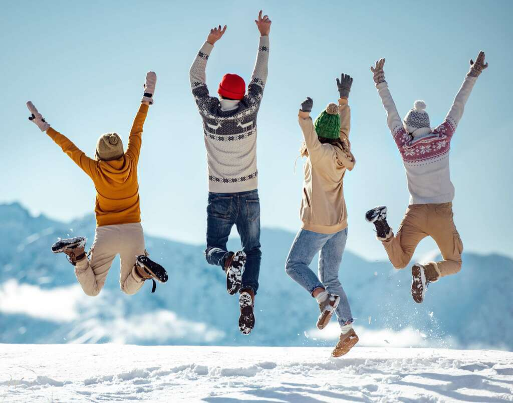

# Arctic Sleddog Club

## Introduction

### Welcome to the website of Arctic Sleddog Club

The Arctic Sleddog Club is a club located in the far north of Sweden in a town called Abisko.
There are more than 4000 dogs in the area and sleddog tourism is a big source of income. Despite that there are no training or educational facilities. When the season starts most kennels and companies have to teach and train their employees by them selves for several weeks before they can start working with the tourists. This is both expensive and timeconsuming. For the natives who wants to know more about sleddogs the closest club and training facility are in Kiruna approximately 250km away.

The Arctic Sleddog Club is seated at the base of the mountain in beautiful surroundings. But even though the nature is beautiful the weather can rapidly change, and it can be dangerous if you are not prepared for the arctic climate. The temperature falls below -40 degrees Celsius some weeks over the year and lavins are frequently occurring. The cold and long winter season, the guarantee of enough snow on the trails and the big population of sleddogs makes the location for the club optimal. The club wants to spread the knowledge about how to enjoy dogsledding in the mouintanins while still being safe.

*The Arctic Sleddog Clubs purpose is to educate and spread the knowledge about sleddog culture and to engage people in outdoor activities in an arctic environment.
*To educate train for and participate in sleddog races.
*To promote good dogcare and sportsmanship and work against doping and discrimination in sports.
*The website is a three-page website. It features an home page, a courses page and an about page where you can read about when, where and what the next course is about.

_Please note that this site is a fictional website using HTML and CSS and was created for The Code Institutes Milestone Project 1. There are no Arctic Sleddog Club even though there are demands for it._

# UX

## Development Plane

### Strategy Plan

The site is fictional.
Reaserch was made online and by interviews of members from different sleddog associations.
I discovered that people living and visiting the area mainly did so due to its beautiful nature, and sleddog tourism is a big source of income.
Research also told me that there are almost as many sleddogs as people in the county of Kiruna.
The nature is free for everyone to visit, but there are regulations that needs to be followed in the mountain area, especially when comes to areas with reindeers.
The arctid climate and vast wild nature with frequent lavins makes it important to have the right knowledge before driving sleddogs in the area.

#### User goals

- The site targets young people and adults with an interest in sleddogs and nature.
- Living or spending time during the winter in the area.
- To spread the knowledge about sleddogs and its culture and how to behave in the mountains in an arctic climate.

#### First time user

- Create a professional design that are not causing information overload. When I did research I found out that many websites of sleddog clubs  was cropped with information and had flawed layout.
- To make a user easily navigate between the pages and attract with both text and visual images.
- To find information about the content, location, time and price of the upcoming course.
- Give access to social media links for reviews and other information.

#### Returning user and first-time user

- As both a returning and first-time visitor I want to easily be able to contact the Sleddog Club.
- To create a design that would be fully responsive on all devices and screen sizes.

#### Business goals

The website is mainly for individuals but when information aspreads, the understanding and knowledge of the sport and sleddog culture increases which gives positive effects also on businesses. 

- Increased interest in the sport can give the business more customers.
- The business can hire educated staff instead of putting several weeks into training new staff by themselves as is for now.
- When people following the rules in the mountains, the reindeers gest less stressed and the Sami are getting healthier animals with higher survival rate. This gives a good relation with the natives and makes the club able to use their land for the clubs purposes.
- Advertising, sponsorship on competitions and businessevents also gives profits.
- The tourism companies can hire educated staff which saves several weeks of time and money.
  
### Other considerations

#### The Arctic Sleddog Club has a B2C (Business-to-costumer) approach

- The design stands out amongst the competitors.
- Minimal content and large images to avoid informational overload as in many similar websites.
- The content and headlines are appealing and fills a purpose.
- There are no other clubs in the area but a lot of sleddogs.

## DESIGN PROCESS

1.Strategy plane

I wanted to create a page that could gather people with similar interests and spread knowledge about sleddogs.
I had recently started to learn how to write code and my aim for this project was to apply what I had learned in HTML and CSS.

2.Scope plan

-I decided that since the nature and dogs is the main reason people would visit the page it is important to have images visualizing the experiences the people joining the club and attending the course would have.
-I needed a contact form.
-Location, meeting hours and costs.
-Information about what to expect taking the course.
-Information about the club.

*Functionality requirements:
The user needs to be able to navigate through the website to access all the contents.
The user can easily contact the club.

3.Structure plane

When I had decided what features I wanted, I began to create the structure of my design into pages.

-The Home page would tell the user they are visiting a site for a Sleddog club.
That the club is in a mountain area with beautiful and relaxing environments and the contact information.
An inspirational text gives a mental picture of what you can experience.

-The Courses page tells the user when, where, the price and content of the next course.

-The About us page tells the user a little about the club and what regulations need to be followed.
There are a contact form.

There is a navigation menu bar to easily navigate between the pages that encourages the user to stay motivated and continue to the next step.

4.Skeleton plane

Wireframes were made in Balsamic to design the navigation and interface for desktop, tablets and mobile.
The header and footer remain the same over the pages with functional icons and navigation.

5.Surface plane

**Colors**
The colors needed to match the colors in the sky and snow on the ground. Since the snow and sky are complex with a lot of different shades and contrasts during the day, I chose soft colors that suited that color scheme. I used Hexcolorpedia and Ginifab.com to identify colors from the image on home page and used them as the base for the rest of the colours.
As a background colour in case the images does not load I chose #lightblue. For the paragraphs in the courses page a light blue rgb(132,172,222 0.2) and light pink rgb(220,173,170 0,2) and the form in about us is also the light pink colour.

**Favicon**
The Favicon was created from a picure of one of my own sleddogs using RedKetchup.

**Fonts**
I chose the fonts by testing different types on Google Fonts.
The main fonts used on the website and the logo is Lato light 300, a sans-serif font. I used a font called Philosopher, also a sans-serif, for the inspirational text on the Home page and the headings. For the headings and paragraphs I used the dark colour #3a3a3a. For the header and footer i used the light #ffffff for high contrast.

**Images**
The background image on the home page is borrowed from my friends private collection Anna Norman at Lifestyle North AB/Kiruna Dogsled AB.

The remaining pictures are from iStock free photos. The photos represent different parts of the sleddog sport and are motivational.

I also added a YouTube sleddog movie made by National Geographic to add both sound and visual effects. 

FEATURES
The Home Page:

The Header
The logo has the heading with the name of the club to easily understand what the site is all about.
The navigation bar includes links to the Home, Course and About us. The links helps the user to easily navigate to a specific content they are looking for without having to use the back button in the browser head or keep scrolling down to find the relevant content. The nav links have an active state which changes according to which section the user is currently looking at. On smaller screens the navbar is an burger-icon that toggles down and on larger screen the navigatin links are spread out evenly. The header remains in the same position and style over the website.

The landing page image
The image covers 100% of the viewport width. The main colours are light and gives a good contrast to the text. It is fully responsive.
Th hero-imagThe project was developed in Codeanywhere, commited to Git and pushed and stored to GitHub. <https://wiklundm.github.io/arcticsleddogclub/>ple to imagine that relaxing feeling and to want to experience driving a dogteam to make them interested in participate in the club.
The covertext invites the reader to read more and explains what to expect.

There are an inspirational text under the image to give the user an idea of the experience.

Contact section
The contact information is easy and quick to find both for the first-time user and the returning customer. The text is centered on all all sizes of devices.

The Courses page:

The first image tells the user a story that there are different ways to ride a sled and different dogs can be used as a sleddog. The sleddog club can also attract children who wants to learn about the sport.

Information and course content, additional information:
There are lists with short information about the course content, time and place for the next course and additional information good to know.

Youtube video:
There are a free youtube video recorded by National Geographic that makes the user experience the sport visually with moving pictures and sound. The video is set to be started as muted. The video have access to full screen controls.

The About us page:

The first image illustrates how happy you will be when becoming a member and a sence of belonging to a team.

About us text
The text is a short explanation of the clubs purpose and its responsibilies.

The form
The user can to leave a message on any subject regarding sleddogs and also apply for the course.
The form requires the user to fill it out correctly before clicking the CONTACT US button. The button is responsive (confirmed by sending the user to a template page borrowed from Code Institute). The background color is the same color set on the section for time and place on the courses page. This gives a consistent theme.

Skijouring image
The image shows the user the discipline of skijouring to inspire sending questions about the sport.

The Footer
The footer uses the same theme as the Navbar and provides the social media links of the club, that opens in a new tab. The style remains the same over the webpages.

Features to be implemented in the future:

- Choices to pay in different ways such as Paypal and bank-transfer.
- Choices to change the language of the website to Swedish
- Add Captcha to the contact form to allow better security from spam.
- Choices for GDPR
- A separate page for those interested in competitions.
- A Gallerypage with pictures from different disciplines, courses and competitions made by the club.

Technologies used

*Language: HTML5 and CSS3
*Google fonts was used to import Lato and Philosopher fonts
*Fontawesome to import icons for UX purposes and to look good
*Codeanywhere to write the code
*GitHub to store the project and Gitpod terminal to commit to Git and push to GitHub
*Balsamic to create the wireframes during the design process
*Am I Responsive to preview the website on different devices
*Istock was the sorce of several of the images used in my project.
\*Favicon was created using RedKetchup from a picture of one of my own sleddogs

Issues and bugs

The biggest issue was my bad internet connetion. The Codeanywehere often stopped working, had to be reloaded, data was not being pushed and meny times I did not know if it was the code that was wrong or the connection problem.This was frustrating and very timeconsuming since I hade to start over and over again meny times and made me unsurtain of my code. This problem was unfortunately nothing I could fix due to there are no better service here, just try to work around it and push more often.
The nest issue that made a lot of more issues stacking up was when my free codingtime on Codeanywhere was stopped. I got another free account from CodeInstitute. The problem was to transfer the project to the place. It seemed to work for a little time but when the old one stopped working I was not able to push or change anything in the new account either. This was also very timeconsuming and for days I could not code since we did not had any education on that part from the program. I searched for solutions how to merge the accounts on stack.

Issue:
The flexbox properties for the contact page -section meeting would not align to the left on and the course content info would not align to the right.
Solution:

Issue:
Css warning: Importent statement do not load in parallel (@import google fonts).
Solution: after reading all I could find on stack and talking to my mentor we decided to ignore the issue since it did not made any real problem.

# Deployment

To make my project viewable to others.
The project was developed in Codeanywhere, commited to Git and pushed and stored to GitHub pages. This allowed me to share the live website with others. <https://wiklundm.github.io/arcticsleddogclub/>

Testing
W3C Css and HTML validatorservice was used throughout the project to check whether there were any errors in my code.
I manualy tested the project on Google Chrome, Microsoft Edge and Apple Safari browsers. This did not lead to any problems.
I used a mobile first approach. I continued to test the responsiveness throughout the development process. I used Google Chromes Dev Tools to view the result on different screen sizes. By doing so I adjusted margins, paddings and image sizes to fit different screen sizes.

Menu bar: Clicking on the Logo or Home link returns the user to the Home page. Clicking on the Courses link takes the user to the Courses page. Clicking on the About us link directs the user to the About us page.

Footer: Clicking on the Facebook icon takes the user to the Facebook page. Clicking on Instagram takes the user to Instagram page
Clicking on Twitter takes the user to Twitter page.

Form: I manually tested that the form requested input data in name fields and an email adress in email-field and that you could not continue without filling in the data requested. I tested that the contact us button was responding by sending me to the test template page when I clicked the button.

Credits:
The content of the website is fictional and created by myself.
The images are from Istock except from the homepage hero picture that is borrowed from my friend Anna Norman on Lifestyle North AB/Kiruna Dogsled.
Information on how to make the Burger icon I found on stack and the lessons from Code institute.

Acknowledgements:
Stack community for information when I encourtered a problem regarding the code and Code Institute regarding coding time and account issue.
Thanks to my mentor Daniel Hamilton for helpful feedback.
